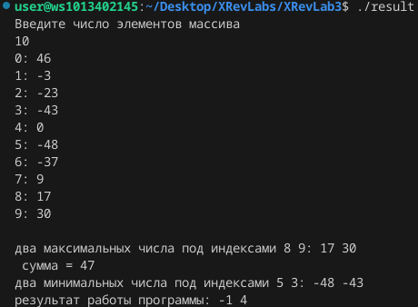

# Лабораторная работа №3
### Задание
1. Напишите программу по своему варианту.
2. Оформите отчёт в README.md. Отчёт должен содержать:
    1. Задание
    2. Описание проделанной работы
    3. Скриншоты результатов
    4. Ссылки на используемые материалы

### Описание проделанной работы
Написал программу по варианту 8
Оформил отчёт в файле readme.md

#### Инструкция по запуску
1. Открыть папку XRevLab2 с помощью VSCodium
2. Вызвать консоль и прописать `gcc nname.c -o result` 
3. прописать в консоли `./result` 

### Вывод программы

### Ссылки
1. https://evil-teacher.on.fleek.co/prog_pm/term1/lab03/
